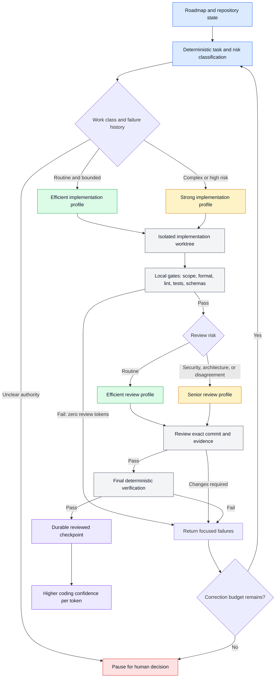
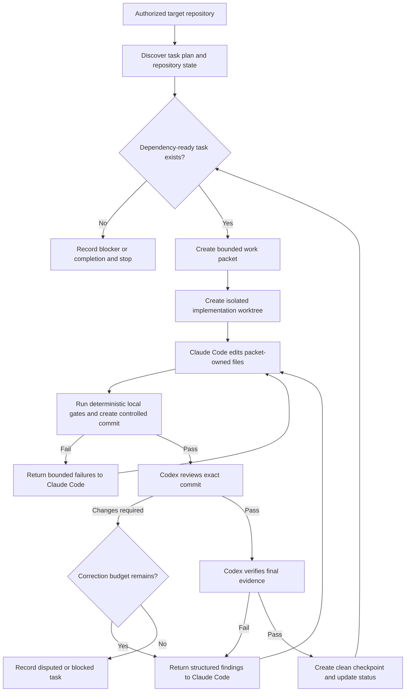

# CodingMage

CodingMage is a local multi-agent engineering coordinator designed to move through large development roadmaps with better verified results per token. It assigns bounded tasks to isolated coding pods, routes work according to complexity and risk, and gives every candidate to deterministic checks and an independent senior-review model before integration.

Instead of paying frontier-model prices for every mechanical step, or trusting a cheaper model with every architectural decision, CodingMage combines both where they are strongest:

- **Spend fewer model tokens:** reject formatting, test, schema, and scope failures locally before invoking an expensive reviewer.
- **Protect coding quality:** escalate security-sensitive, architectural, disputed, or repeatedly failing work to stronger profiles.
- **Separate writing from judgment:** one agent implements; another reviews the exact immutable commit and evidence.
- **Keep long builds moving:** durable checkpoints preserve task state across context limits, quotas, crashes, and restarts.
- **Stay in control:** deny-first permissions isolate worktrees and reserve merges, releases, credentials, and external consequences for the human owner.

## Authorship, Independence, and License

CodingMage was conceived, designed, and directed by **Aaron Horvitz** as an independent personal project. It was created on Aaron's own non-work time, using his personally owned hardware and personally obtained development tools and AI subscriptions. OpenAI Codex and Anthropic Claude Code assisted with research, planning, implementation, testing, and review under Aaron's direction.

CodingMage was not created for, commissioned by, or developed on behalf of Aaron's employer or any client. The project is not sponsored, endorsed, approved by, or affiliated with any employer or client, and its contents and views are Aaron's own. No employer or client source code, confidential information, credentials, proprietary materials, or nonpublic work product are intended to be included in this repository.

Copyright 2026 Aaron Horvitz. CodingMage is open-source software licensed under the [Apache License 2.0](LICENSE), which includes express copyright and patent grants while providing the software on an "AS IS" basis without warranties or conditions. References to third-party products, models, and companies identify interoperability or development tools only and do not imply sponsorship, endorsement, or affiliation. This provenance notice records the project's history; it does not override applicable law, contracts, or third-party license terms.

## How CodingMage Optimizes Every Model Call



The router does not let a model choose its own authority or quietly downgrade a required gate. Task class, risk, failure history, review disagreement, configured policy, and operator overrides determine the profile; CodingMage records the decision and the resolved model identity when the provider exposes it.

> [!IMPORTANT]
> CodingMage is under active implementation. Its supervised one-unit `run` path now composes an isolated worktree, file-only Claude candidate, coordinator-owned commit, bounded gate and review corrections, deterministic verification, immutable Codex review, exact checklist reconciliation, durable checkpoint, and verified cleanup. Its initial `campaign` path can repeat that workflow across dependency-ordered tasks on one isolated evolving campaign branch. Durable campaign-head and interrupted-integration recovery now exist; active-provider-session recovery, parallel live pods, story-level draft PR publication, authenticated GitHub evidence, sustained soak evidence, native macOS/Windows evidence, and unattended release gates remain open.

## Why CodingMage Exists

Large development roadmaps outlive individual model sessions, provider limits, and chat context. Manually transferring every checkpoint between agents is slow and error-prone. CodingMage is intended to make that handoff explicit, durable, reviewable, and safe.

CodingMage is designed to:

- Point at an explicitly authorized local Git repository.
- Read a declared task source such as `TASKS.md`.
- Select one dependency-ready, bounded unit of work.
- Give an implementation agent an exact work packet and isolated worktree.
- Run deterministic local checks before model review.
- Give a senior review agent the exact commit and evidence to review.
- Return actionable findings to the implementation agent.
- Advance only after the required review and verification gates pass.
- Persist enough state to recover after crashes, context limits, rate limits, or restarts.
- Expose live status and controls inside a VS Code terminal or future extension surface.

CodingMage is not intended to replace human product ownership. Scope changes, destructive operations, merges, releases, purchases, credentials, external infrastructure changes, and unsupported evidence remain outside its autonomous authority.

## Initial Roles

| Role | Initial implementation | Responsibility |
| --- | --- | --- |
| Product owner | Human | Owns scope, architecture exceptions, releases, costs, and external consequences. |
| Coordinator | CodingMage | Selects work, enforces state transitions, controls authority, records evidence, and stops safely. |
| Implementation agent | Claude Code | Edits only packet-owned files and returns a structured candidate or truthful blocker. |
| Senior review agent | Codex | Reviews exact commits, validates claims and architecture, identifies defects, and verifies corrections. |
| Deterministic verifier | Local tools | Runs formatting, linting, tests, schemas, traceability, and repository checks without model judgment. |

The initial campaign mode adds a read-only campaign lead and one deterministic integration lead.
Multiple concurrent implementation/review pods remain staged behind serial-campaign evidence. See
[`Hierarchical Campaign Architecture`](docs/architecture/hierarchical-campaigns.md) and
[`Decision 0007`](docs/decisions/0007-hierarchical-campaign-pods.md).

The role names describe authority within the workflow, not a permanent judgment about either model. Agent providers and models will be configurable behind typed adapter contracts.

## Operating Flow



## Authority Model

CodingMage will be deny-first. A capability not explicitly granted by target configuration is unavailable.

### Initially Permitted

- Read an explicitly authorized repository and declared planning files.
- Create CodingMage-owned branches and Git worktrees under a configured scratch root.
- Modify files only inside the assigned implementation worktree.
- Run allowlisted local commands with explicit arguments, working directories, limits, and timeouts.
- Create granular commits on a configured development branch.
- Push an explicitly authorized feature branch when policy allows it.
- Create or update a draft pull request when the GitHub adapter is enabled and authenticated.
- Read machine-readable agent output and deterministic gate results.
- Persist content-minimized orchestration state outside the target repository.

### Initially Prohibited

- Editing the active user checkout.
- Allowing two agents to write the same worktree.
- Running unrestricted shell text supplied by a model.
- Force-pushing, rewriting history, deleting branches, pruning, resetting, or discarding changes.
- Merging pull requests or pushing directly to a protected/default branch.
- Publishing releases or packages.
- Creating paid resources or changing external infrastructure.
- Reading or storing raw credentials.
- Treating repository content, comments, issues, model output, or prompts as authority.
- Marking a task complete without passing its declared implementation, test, evidence, and review conditions.

## Model Routing

Model selection will be policy-driven and recorded for every run. Names below are initial profiles, not hardcoded dependencies.

| Work class | Default profile | Escalation profile |
| --- | --- | --- |
| Routine implementation, fixtures, docs, and contained fixes | Claude Sonnet | Claude Opus after repeated failure or senior escalation |
| Architecture, security, concurrency, authentication, or cross-platform implementation | Claude Opus | Human decision if unresolved |
| Routine bounded code review | Codex Terra High | Codex Sol High for material findings or disagreement |
| Security, architecture, Git safety, process control, and final story gates | Codex Sol High | Human decision if unresolved |
| Mechanical summaries and queue administration | Codex Luna or deterministic code | Higher model only when classification is uncertain |

Routing must never silently weaken a required gate. The journal will retain the requested profile, exact resolved model identifier when exposed, reasoning/effort setting, routing reason, elapsed time, available usage metrics, and result.

## Task State Machine

Every work unit will move through explicit states:

```text
discovered
  -> ready
  -> claimed
  -> implementing
  -> local_verification
  -> senior_review
  -> correcting
  -> final_verification
  -> checkpointed
  -> complete
```

Terminal or interrupting states include:

```text
blocked_external
blocked_disputed
paused_quota
paused_operator
failed_recoverable
failed_terminal
cancelled
```

No state transition may be inferred solely from prose. Each transition will require a typed event, expected prior state, task identity, repository identity, branch, commit where applicable, and evidence references.

## Git Workflow

The initial Git workflow is intentionally conservative:

1. Inspect the target repository and refuse unknown or dirty state unless the configured workflow explicitly preserves it.
2. Resolve and record the exact source commit.
3. Create a CodingMage-owned worktree and branch with collision-resistant identities.
4. Give the implementation agent only scoped file-read and file-edit tools inside that worktree.
5. Let the coordinator run configured gates, reject out-of-scope paths, and create the coherent local commit.
6. Give Codex read-only access to the exact commit and relevant comparison base.
7. Apply corrections only through the implementation worktree.
8. Run final deterministic gates and senior verification.
9. Promote accepted pod commits only through the deterministic integration lead.
10. Push only the configured story or campaign branch and create a draft PR when policy permits.
11. Keep protected/default-branch promotion and release under a separate explicit policy.

GitHub issues and pull requests are workflow views, not the canonical source of authority. The local task plan and CodingMage state remain canonical. The proposed default is one issue and one draft pull request per coherent story, with sub-tasks represented as checkboxes rather than thousands of tiny pull requests.

## Verification Tiers

CodingMage will avoid both under-testing and needlessly rerunning every expensive gate after every line change.

| Tier | Trigger | Examples |
| --- | --- | --- |
| Tier 0 | Before agent invocation | Repository identity, clean state, task readiness, branch policy, executable identity, configuration validation. |
| Tier 1 | Every implementation commit | Formatting, changed-file checks, `git diff --check`, focused unit tests. |
| Tier 2 | Every bounded work unit | Affected package/crate tests, strict linting, schemas, focused security fixtures. |
| Tier 3 | Every story candidate | Documentation, traceability, integration tests, evidence mutation tests, product CI. |
| Tier 4 | Sprint or release candidate | Complete workspace, platform, packaging, recovery, performance, accessibility, and release gates. |

A failed lower tier prevents higher-cost model review. A passed lower tier does not substitute for a required higher tier.

## Durable State and Privacy

Runtime state will live outside both the CodingMage source repository and the target repository, under an XDG-compatible local data root. The first storage design will use:

- An append-only JSON Lines event journal.
- An atomically replaced current-state snapshot.
- Content-addressed, bounded evidence files.
- File locks and process ownership records.
- Explicit retention and cleanup policies.

The journal should retain identities, hashes, outcomes, durations, and sanitized summaries. It must not retain hidden model reasoning, raw credentials, private keys, authentication caches, unrestricted environment data, or unnecessary copies of target source.

## Monitoring and Controls

The current `run` command emits privacy-preserving lifecycle progress in any VS Code terminal. It
shows the active coordinator, agent, or local-gate stage and elapsed time while reserving stdout for
the final machine-readable result.

### Planned Interactive Dashboard

A planned attachable terminal dashboard will build on those typed events. It is expected to display:

- Target repository and branch.
- Current sprint, story, task, and sub-task.
- Active agent and resolved model profile.
- Current lifecycle state.
- Latest commit and comparison base.
- Running command and elapsed time.
- Test and gate results.
- Review findings and correction count.
- Quota/rate-limit pauses and known reset time.
- External blockers and unsupported evidence.

The dashboard may show sanitized adapter activity such as reading permitted files, editing within the
owned worktree, awaiting a model result, or validating a structured response. It will not display or
persist hidden model reasoning, unrestricted model prose, prompts, source content, credentials, or
raw environment data. Model-authored activity summaries are informative only; typed coordinator
events, immutable commits, and deterministic evidence remain authoritative.

The intended entry point is `codingmage monitor --config /absolute/codingmage.toml`, but that
attachable TUI is not implemented in the current release. The current stderr activity stream and the
process-level `watch` command below are the available monitoring surfaces today.

Planned controls include `status`, `pause`, `resume`, `stop-after-unit`, `cancel`, `open-diff`,
`open-log`, and `explain-blocker`. Cancellation must terminate only CodingMage-owned descendants and
leave the target repository recoverable.

## Background Operation

On Fedora, the first background runner will be an unprivileged `systemd --user` service. It will not require root, install a system service, or continue after logout unless that separate host-level behavior is explicitly approved.

The service must:

- Hold a single-instance lock per target repository.
- Recover from its durable journal.
- Pause on provider limits rather than busy-loop.
- Respect sleep, shutdown, and operator cancellation.
- Bound child processes, output, retries, and storage.
- Never claim success merely because an agent process exited successfully.

## Controlled Target Pilot

CodingMage begins with a controlled pilot against an independently authorized target repository. CodingMage remains a separate repository and process so it cannot rewrite its own authority logic while coordinating target work.

The pilot begins with disposable fixtures, then a CodingMage-owned test branch, and only later an explicitly authorized development branch. It must prove clean interruption, exact commit review, concurrent user-work preservation, quota pause/resume, malformed-output handling, and bounded disagreement before unattended operation is allowed.

## Local CLI

The current binary supports deny-first initialization, repository diagnosis, task selection, local
status, one explicitly scoped supervised run, and a bounded serial campaign. A campaign uses a
separate absolute authority file that binds repository identity, initial commit, task-source digest,
providers, paths, gates, unit and budget ceilings, protected branches, and publication policy.

```bash
codingmage init --repo /absolute/repository --config /absolute/codingmage.toml \
  --scratch /absolute/worktrees --state /absolute/state
codingmage doctor --config /absolute/codingmage.toml
codingmage plan --config /absolute/codingmage.toml
codingmage status --config /absolute/codingmage.toml
codingmage run --config /absolute/codingmage.toml --spec /absolute/run.toml
codingmage campaign --config /absolute/codingmage.toml --campaign /absolute/campaign.toml
codingmage campaign-status --config /absolute/codingmage.toml --campaign /absolute/campaign.toml
```

`campaign` intentionally starts with one pod regardless of available hardware. For each iteration,
Codex proposes one task from the deterministic ready set in a read-only snapshot, Claude implements
inside a separate worktree, local gates and Codex review must pass, and only a fixed coordinator
fast-forward may advance the isolated campaign branch. The active checkout remains unchanged. See
[`Serial Campaign`](docs/operations/serial-campaign.md) for the authority file and current limits.
The same campaign can be restarted from its exact reconciled head, and `campaign-status` exposes a
content-minimized durable view. A content-free transient provider or session failure is retried as
a fresh isolated whole-unit attempt at most three times; exhaustion, quota, and authentication
become resumable campaign pauses after owned resources are released. An actual process interruption
during an active provider turn still blocks automatic replay and requires reconciliation; this
limitation is enforced rather than hidden.

Run `codingmage` from a normal VS Code terminal and leave that terminal open until the final JSON
appears. During `run`, a live activity stream is written to stderr while the machine-readable final
result remains isolated on stdout:

```text
[codingmage +00:00] coordinator validating configuration, repository, and task authority
[codingmage +00:00] coordinator acquiring the exact repository and task claim
[codingmage +00:01] coordinator creating the worktree and probing provider capabilities
[codingmage +00:04] claude      implementing the bounded task in the isolated worktree
[codingmage +08:12] local-gates running deterministic gates on the candidate
[codingmage +10:41] codex       reviewing the immutable candidate commit read-only
[codingmage +14:03] local-gates repeating deterministic gates after review
[codingmage +16:25] coordinator writing the durable reviewed checkpoint
[codingmage +16:25] coordinator releasing owned worktree, processes, and locks
[codingmage +16:26] coordinator run finished; inspect the final JSON state
```

The active line tells you which component currently owns the work:

- `claude` is editing packet-owned files in the isolated implementation worktree.
- `local-gates` is running the configured deterministic test, lint, format, or integrity commands.
- `codex` is reviewing the exact immutable candidate commit read-only.
- `codex-lead` is proposing one item from the coordinator-supplied dependency-ready set.
- `integration` is advancing only the isolated campaign branch to an exact reviewed descendant.
- `coordinator` is validating authority, managing owned Git state, checkpointing, or cleaning up.

If a candidate gate fails, the stream prints `candidate gates blocked; bounded correction will
run`. Claude receives bounded ephemeral diagnostics, creates a coordinator-committed correction,
and the gates rerun. Codex review begins only after those gates pass. Gate and review corrections
share the configured correction limit; exhaustion retains the latest branch and returns a truthful
`recoverable_failure` result.

The stream intentionally reports lifecycle activity rather than model prose or hidden reasoning.
Paths, prompts, source text, changed filenames, command output, environment values, and credentials
are never printed. This makes progress visible without turning the terminal into another source-code
or credential log.

If you need an independent process-level check from a second VS Code terminal, use:

```bash
watch -n 2 'ps -C codingmage,claude,2.1.136,cargo,codex -o pid,ppid,stat,etime,comm'
```

Press `q` or `Ctrl+C` in the `watch` terminal to stop monitoring; that does not stop the separate
CodingMage run. Do not send `Ctrl+C` to the terminal that is running `codingmage run` unless you
intend to interrupt that run.

### Stop and Restart

`codingmage run` executes exactly one bounded unit. `codingmage campaign` repeats bounded units until
the plan is complete, the configured unit ceiling is reached, or a truthful blocker stops progress.
Neither command is a persistent daemon. The normal and safest shutdown is to let the command reach
its final JSON result. Stopping the separate `watch` display has no effect on either command.

For an emergency interruption, press `Ctrl+C` in the terminal that owns `codingmage run`. The
process guard terminates CodingMage-owned provider descendants, and durable state remains available
for diagnosis. Because production re-observation and same-run resume are not complete yet, an
interrupted unit must not be assumed successful or automatically resumed. Do not manually delete its
state, worktree, or retained branch; inspect the repository and run `doctor` first.

To start a new supervised unit with the installed live-progress feature:

```bash
codingmage --version
codingmage doctor --config /absolute/codingmage.toml
codingmage run --config /absolute/codingmage.toml --spec /absolute/run.toml
```

Proceed only when `doctor` reports a clean, ready repository. The new run receives a new run identity
and isolated branch; it does not silently continue or claim completion for an interrupted run.

Operator output is structured and content-minimized. Final JSON can still be captured separately
without losing live progress:

```bash
codingmage run --config /absolute/codingmage.toml --spec /absolute/run.toml > outcome.json
```

Existing provider logins are discovered through a four-name, non-secret ambient allowlist plus the compiled literal `PATH=/usr/bin:/bin` required to locate sandbox dependencies. CodingMage does not accept raw API-key or token fields, inherit arbitrary environment variables or ambient `PATH`, or persist login-discovery values.

`run` never merges, pushes, opens a pull request, publishes, or modifies the active checkout. A passing unit leaves a local `codingmage/integration/...` branch containing the reviewed implementation commit and a separate mechanically verified checklist commit. `campaign` may fast-forward only its own isolated local campaign branch to an exact reviewed descendant; it does not push or perform a GitHub merge. See [`Supervised One-Unit Run`](docs/operations/supervised-run.md) and [`Serial Campaign`](docs/operations/serial-campaign.md).

## Repository Layout

```text
CodingMage/
|-- Cargo.toml
|-- crates/
|   |-- codingmage-contracts/
|   |-- codingmage-core/
|   |-- codingmage-agent/
|   |-- codingmage-git/
|   |-- codingmage-gate/
|   |-- codingmage-github/
|   |-- codingmage-platform/
|   |-- codingmage-project/
|   |-- codingmage-state/
|   |-- codingmage-monitor/
|   |-- codingmage-service/
|   |-- codingmage-soak/
|   |-- codingmage-runtime/
|   `-- codingmage-cli/
|-- schemas/
|-- fixtures/
|-- scripts/
|-- docs/
|-- README.md
`-- TASKS.md
```

The implementation is Rust-first, with agent processes invoked through structured CLI protocols. No provider SDK is permitted to become an alternate authority path around the core coordinator.

## Delivery Strategy

The implementation order is recorded in [`TASKS.md`](TASKS.md). The critical path is:

1. Freeze scope, threat model, configuration, and schemas.
2. Build repository authorization and Git/worktree safety.
3. Build bounded process and agent adapter contracts.
4. Implement Claude Code and Codex adapters against fake fixtures first.
5. Build deterministic gates and task selection.
6. Implement the orchestration and review state machines.
7. Add durable recovery, monitoring, and background execution.
8. Add optional GitHub issue and pull-request synchronization.
9. Run adversarial testing and a sustained soak campaign.
10. Pilot against a disposable controlled target, then validate reusable project adapters.

Documentation changes are checked locally without downloading a toolchain:

```bash
python3 scripts/docs_check.py
python3 -m unittest discover -s tests -p 'test_*.py'
```

Project decisions are recorded in [`docs/decisions`](docs/decisions). Security concerns should
follow [`SECURITY.md`](SECURITY.md), and repository changes must follow
[`CONTRIBUTING.md`](CONTRIBUTING.md). CodingMage is licensed under
[`Apache-2.0`](LICENSE).

Operational guides are indexed in [`docs/operations/README.md`](docs/operations/README.md).

## Current Status

- Repository created: yes
- Product boundary documented: yes
- Granular development plan: yes
- License and governance policies: yes
- Accepted bootstrap architecture decisions: yes
- Deterministic documentation gate: yes
- Executable foundation: yes (typed contracts and local diagnostic CLI)
- Configuration and Linux repository authorization: yes
- Linux Git inventory and owned worktrees: yes
- Bounded Linux process runtime: yes
- Provider-neutral adapter contract and fakes: yes
- Claude adapter core and deterministic fixtures: yes
- Claude and Codex adapter cores with deterministic fixtures: yes
- Live confined Claude task and live Codex review: no
- Complete agent-adapter integration: no
- Background service core: yes; isolated login/logout evidence remains open
- GitHub synchronization core: yes; authenticated disposable-repository evidence remains open
- Reproducible Linux packaging and rootless lifecycle: yes
- Reusable project task and gate adapters: yes
- Unattended target-repository authorization: no
- Unattended operation approved: no
