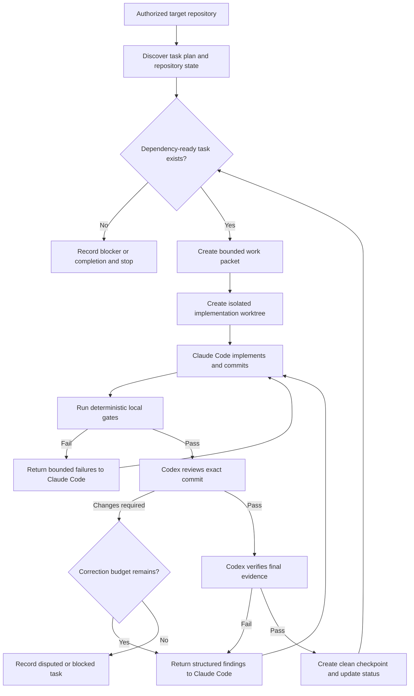

# CodingMage

CodingMage is a local, reusable development coordinator for running bounded implementation and review loops across coding agents. Its first workflow uses Claude Code as the implementation agent and Codex as the senior review and verification agent, while deterministic local tools remain the authority for formatting, tests, schemas, and repository state.

> [!IMPORTANT]
> CodingMage is currently a planning-only repository. No executable coordinator, background service, GitHub automation, or autonomous development capability exists yet. The proposed commands and interfaces below are design targets, not current functionality.

## Why CodingMage Exists

Large development roadmaps outlive individual model sessions, provider limits, and chat context. Manually transferring every checkpoint between agents is slow and error-prone. CodingMage is intended to make that handoff explicit, durable, reviewable, and safe.

CodingMage will:

- Point at an explicitly authorized local Git repository.
- Read a declared task source such as `TASKS.md`.
- Select one dependency-ready, bounded unit of work.
- Give an implementation agent an exact work packet and isolated worktree.
- Run deterministic local checks before model review.
- Give a senior review agent the exact commit and evidence to review.
- Return actionable findings to the implementation agent.
- Advance only after the required review and verification gates pass.
- Persist enough state to recover after crashes, context limits, rate limits, or restarts.
- Expose live status and controls inside a VS Code terminal or future extension surface.

CodingMage is not intended to replace human product ownership. Scope changes, destructive operations, merges, releases, purchases, credentials, external infrastructure changes, and unsupported evidence remain outside its autonomous authority.

## Initial Roles

| Role | Initial implementation | Responsibility |
| --- | --- | --- |
| Product owner | Human | Owns scope, architecture exceptions, releases, costs, and external consequences. |
| Coordinator | CodingMage | Selects work, enforces state transitions, controls authority, records evidence, and stops safely. |
| Implementation agent | Claude Code | Implements one bounded work packet, runs focused checks, commits changes, and corrects accepted findings. |
| Senior review agent | Codex | Reviews exact commits, validates claims and architecture, identifies defects, and verifies corrections. |
| Deterministic verifier | Local tools | Runs formatting, linting, tests, schemas, traceability, and repository checks without model judgment. |

The role names describe authority within the workflow, not a permanent judgment about either model. Agent providers and models will be configurable behind typed adapter contracts.

## Operating Flow



## Authority Model

CodingMage will be deny-first. A capability not explicitly granted by target configuration is unavailable.

### Initially Permitted

- Read an explicitly authorized repository and declared planning files.
- Create CodingMage-owned branches and Git worktrees under a configured scratch root.
- Modify files only inside the assigned implementation worktree.
- Run allowlisted local commands with explicit arguments, working directories, limits, and timeouts.
- Create granular commits on a configured development branch.
- Push an explicitly authorized feature branch when policy allows it.
- Create or update a draft pull request when the GitHub adapter is enabled and authenticated.
- Read machine-readable agent output and deterministic gate results.
- Persist content-minimized orchestration state outside the target repository.

### Initially Prohibited

- Editing the active user checkout.
- Allowing two agents to write the same worktree.
- Running unrestricted shell text supplied by a model.
- Force-pushing, rewriting history, deleting branches, pruning, resetting, or discarding changes.
- Merging pull requests or pushing directly to a protected/default branch.
- Publishing releases or packages.
- Creating paid resources or changing external infrastructure.
- Reading or storing raw credentials.
- Treating repository content, comments, issues, model output, or prompts as authority.
- Marking a task complete without passing its declared implementation, test, evidence, and review conditions.

## Model Routing

Model selection will be policy-driven and recorded for every run. Names below are initial profiles, not hardcoded dependencies.

| Work class | Default profile | Escalation profile |
| --- | --- | --- |
| Routine implementation, fixtures, docs, and contained fixes | Claude Sonnet | Claude Opus after repeated failure or senior escalation |
| Architecture, security, concurrency, authentication, or cross-platform implementation | Claude Opus | Human decision if unresolved |
| Routine bounded code review | Codex Terra High | Codex Sol High for material findings or disagreement |
| Security, architecture, Git safety, process control, and final story gates | Codex Sol High | Human decision if unresolved |
| Mechanical summaries and queue administration | Codex Luna or deterministic code | Higher model only when classification is uncertain |

Routing must never silently weaken a required gate. The journal will retain the requested profile, exact resolved model identifier when exposed, reasoning/effort setting, routing reason, elapsed time, available usage metrics, and result.

## Task State Machine

Every work unit will move through explicit states:

```text
discovered
  -> ready
  -> claimed
  -> implementing
  -> local_verification
  -> senior_review
  -> correcting
  -> final_verification
  -> checkpointed
  -> complete
```

Terminal or interrupting states include:

```text
blocked_external
blocked_disputed
paused_quota
paused_operator
failed_recoverable
failed_terminal
cancelled
```

No state transition may be inferred solely from prose. Each transition will require a typed event, expected prior state, task identity, repository identity, branch, commit where applicable, and evidence references.

## Git Workflow

The initial Git workflow is intentionally conservative:

1. Inspect the target repository and refuse unknown or dirty state unless the configured workflow explicitly preserves it.
2. Resolve and record the exact source commit.
3. Create a CodingMage-owned worktree and branch with collision-resistant identities.
4. Give only the implementation agent write authority over that worktree.
5. Require a coherent local commit before review.
6. Give Codex read-only access to the exact commit and relevant comparison base.
7. Apply corrections only through the implementation worktree.
8. Run final deterministic gates and senior verification.
9. Push only the configured feature branch.
10. Leave merge, release, and protected-branch decisions to the product owner unless a future explicitly approved policy says otherwise.

GitHub issues and pull requests are workflow views, not the canonical source of authority. The local task plan and CodingMage state remain canonical. The proposed default is one issue and one draft pull request per coherent story, with sub-tasks represented as checkboxes rather than thousands of tiny pull requests.

## Verification Tiers

CodingMage will avoid both under-testing and needlessly rerunning every expensive gate after every line change.

| Tier | Trigger | Examples |
| --- | --- | --- |
| Tier 0 | Before agent invocation | Repository identity, clean state, task readiness, branch policy, executable identity, configuration validation. |
| Tier 1 | Every implementation commit | Formatting, changed-file checks, `git diff --check`, focused unit tests. |
| Tier 2 | Every bounded work unit | Affected package/crate tests, strict linting, schemas, focused security fixtures. |
| Tier 3 | Every story candidate | Documentation, traceability, integration tests, evidence mutation tests, product CI. |
| Tier 4 | Sprint or release candidate | Complete workspace, platform, packaging, recovery, performance, accessibility, and release gates. |

A failed lower tier prevents higher-cost model review. A passed lower tier does not substitute for a required higher tier.

## Durable State and Privacy

Runtime state will live outside both the CodingMage source repository and the target repository, under an XDG-compatible local data root. The first storage design will use:

- An append-only JSON Lines event journal.
- An atomically replaced current-state snapshot.
- Content-addressed, bounded evidence files.
- File locks and process ownership records.
- Explicit retention and cleanup policies.

The journal should retain identities, hashes, outcomes, durations, and sanitized summaries. It must not retain hidden model reasoning, raw credentials, private keys, authentication caches, unrestricted environment data, or unnecessary copies of target source.

## Monitoring and Controls

The first monitoring surface will be a structured terminal view that works inside VS Code. It will display:

- Target repository and branch.
- Current sprint, story, task, and sub-task.
- Active agent and resolved model profile.
- Current lifecycle state.
- Latest commit and comparison base.
- Running command and elapsed time.
- Test and gate results.
- Review findings and correction count.
- Quota/rate-limit pauses and known reset time.
- External blockers and unsupported evidence.

Planned controls include `status`, `pause`, `resume`, `stop-after-unit`, `cancel`, `open-diff`, `open-log`, and `explain-blocker`. Cancellation must terminate only CodingMage-owned descendants and leave the target repository recoverable.

## Background Operation

On Fedora, the first background runner will be an unprivileged `systemd --user` service. It will not require root, install a system service, or continue after logout unless that separate host-level behavior is explicitly approved.

The service must:

- Hold a single-instance lock per target repository.
- Recover from its durable journal.
- Pause on provider limits rather than busy-loop.
- Respect sleep, shutdown, and operator cancellation.
- Bound child processes, output, retries, and storage.
- Never claim success merely because an agent process exited successfully.

## Initial Target: AgentMage

AgentMage will be CodingMage's first controlled pilot. CodingMage must remain a separate repository and process so it cannot rewrite its own authority logic while coordinating AgentMage.

The pilot will begin with disposable fixtures, then a CodingMage-owned AgentMage test branch, and only later an explicitly authorized development branch. The pilot must prove clean interruption, exact commit review, concurrent user-work preservation, quota pause/resume, malformed-output handling, and bounded disagreement before unattended operation is allowed.

## Planned CLI

These commands are illustrative and are not implemented yet:

```bash
codingmage init --repo /path/to/repository
codingmage doctor --repo /path/to/repository
codingmage plan --repo /path/to/repository --task-source TASKS.md
codingmage run --repo /path/to/repository --task-source TASKS.md
codingmage status --repo /path/to/repository
codingmage pause --repo /path/to/repository
codingmage resume --repo /path/to/repository
codingmage stop-after-unit --repo /path/to/repository
codingmage explain-blocker --repo /path/to/repository
```

## Planned Repository Layout

```text
CodingMage/
|-- Cargo.toml
|-- crates/
|   |-- codingmage-contracts/
|   |-- codingmage-core/
|   |-- codingmage-agent/
|   |-- codingmage-git/
|   |-- codingmage-gates/
|   |-- codingmage-state/
|   |-- codingmage-monitor/
|   `-- codingmage-cli/
|-- schemas/
|-- fixtures/
|-- scripts/
|-- docs/
|-- README.md
`-- TASKS.md
```

The workspace may begin with fewer crates and split only when ownership boundaries become real. The intended implementation is Rust-first, with agent processes invoked through structured CLI protocols. No provider SDK is permitted to become an alternate authority path around the core coordinator.

## Delivery Strategy

The implementation order is recorded in [`TASKS.md`](TASKS.md). The critical path is:

1. Freeze scope, threat model, configuration, and schemas.
2. Build repository authorization and Git/worktree safety.
3. Build bounded process and agent adapter contracts.
4. Implement Claude Code and Codex adapters against fake fixtures first.
5. Build deterministic gates and task selection.
6. Implement the orchestration and review state machines.
7. Add durable recovery, monitoring, and background execution.
8. Add optional GitHub issue and pull-request synchronization.
9. Run adversarial testing and a sustained soak campaign.
10. Pilot against AgentMage, then generalize for other repositories.

Documentation changes are checked locally without downloading a toolchain:

```bash
python3 scripts/docs_check.py
python3 -m unittest discover -s tests -p 'test_*.py'
```

Project decisions are recorded in [`docs/decisions`](docs/decisions). Security concerns should
follow [`SECURITY.md`](SECURITY.md), and repository changes must follow
[`CONTRIBUTING.md`](CONTRIBUTING.md). CodingMage is licensed under
[`Apache-2.0`](LICENSE).

## Current Status

- Repository created: yes
- Product boundary documented: yes
- Granular development plan: yes
- License and governance policies: yes
- Accepted bootstrap architecture decisions: yes
- Deterministic documentation gate: yes
- Executable foundation: yes (typed contracts and empty CLI bootstrap)
- Configuration and Linux repository authorization: yes
- Linux Git inventory and owned worktrees: yes
- Bounded Linux process runtime: yes
- Provider-neutral adapter contract and fakes: yes
- Live Claude and Codex adapters: no
- Agent adapters: no
- Background service: no
- GitHub automation: no
- AgentMage authorization: no
- Unattended operation approved: no
