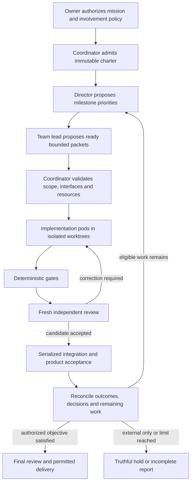

# Autonomous Engineering Team Contract

## Status and Relationship

This is the planned normative extension under
[Decision 0014](../decisions/0014-owner-optional-engineering-team.md),
[PRD.md](../../PRD.md) and Sprints 32 through 35 of [TASKS.md](../../TASKS.md).
It extends existing hierarchical campaigns, autonomous progression and unattended safeguards.
Terms and states below are requirements for versioned contracts, not accepted CLI/configuration
values today. No existing campaign, provider or release is reauthorized by this document.

## One Campaign, Three Planning Levels

The user experiences one campaign. Internally, keep bounded, event-driven work at three levels:

1. The director evaluates objective/milestone progress and proposes priorities or bounded replanning.
2. The team lead decomposes approved work, declares interface dependencies and proposes assignments.
3. Pods implement; independent reviewers and QA evaluate exact candidates and acceptance evidence.

The existing deterministic coordinator validates every proposal and owns all effectful transitions.
There is no model-manager shell authority and no separate director database. A planning role is
invoked at a meaningful event or bounded interval, not in an unlimited conversation with other roles.

## Mission and Delegation Contracts

The mission charter must bind its version and identity, operator identity/authorization digest,
repository identity, initial commit, canonical task/requirements digest, measurable outcomes,
exclusions, architecture invariants, decision-domain grants, allowed roots and command registry,
role/provider/version/strength requirements, involvement mode, decision dispositions, integration
and delivery policy, resource ceilings, expiry, revocation epoch and completion predicates.
Reject unknown fields, stale pins, conflicting grants and unsupported profiles before execution.

A decision-domain grant contains the class of choice, approved alternatives or objective constraints,
affected requirement/interface/path scope, maximum risk, applicable gates and escalation disposition.
It permits the director/lead to propose a technical choice, not to execute it or modify its own
authority. The coordinator derives and validates exact task/effect grants at each step.
Broad natural-language phrases such as "do anything necessary" do not become executable grants.

Delegate architecture/dependency/interface evolution only when the charter names that domain and
its compatibility/verification constraints. Changing the charter requires new authenticated owner
authority and a new generation; it does not revive stale grants or retroactively authorize effects.

## Involvement and Decision Disposition

| Situation | Supervised | Exception-only | Hands-off |
| --- | --- | --- | --- |
| Choice covered by delegation | Apply configured checkpoint policy. | Validate and proceed. | Validate and proceed without a prompt. |
| Undelegated choice | Ask through exact operator channel. | Deduplicate an exception request. | Retain blocked work; no approval request or stdin wait. |
| Transient resource/provider failure | Bounded retry/defer. | Bounded retry/defer. | Bounded retry/defer or qualified permitted alternate. |
| Missing credentials, human review or external evidence | Retain exact unmet prerequisite. | Retain exact unmet prerequisite. | Retain exact unmet prerequisite; never infer it from silence. |
| Policy violation or uncertain effect | Fail closed and reconcile. | Fail closed and reconcile. | Fail closed and reconcile. |

A preauthorized noninteractive disposition can choose an allowed alternative, split already
authorized work, defer until a declared observation changes or mark the affected task blocked.
It cannot approve an operation outside the grant. Record decision identity, observed generation,
scope, selected disposition and source-bound rationale; rejection produces no lease or effect.
Repeated identical no-progress states do not re-prompt, consume an unbounded retry budget or spawn
additional agents. Continue independent eligible work, then return a truthful terminal/paused state.

Preflight must detect configured interactive-only approval, login, package installation or provider
capability discovery paths incompatible with hands-off execution. Do not pipe automatic approval
answers into a provider. The adapter's permissions must already express the permitted boundary.
When a provider unexpectedly asks for input, use a bounded refusal/hold rather than leaving a hidden
process waiting forever. Observer disconnect keeps an admitted campaign running; stop/revocation
is an explicit authenticated control, checked again immediately before effects.

## Role Packets and Independence

All role packets bind mission/generation/task identities, base/candidate commits, input references,
allowed output schema, role capability, deadlines and budgets. Planning responses are typed
proposals, not shell commands. Names such as director or QA confer no additional capability.

The director works from acceptance coverage, dependencies and outcome summaries, not a claim that
the team is busy. The team lead's decomposition must preserve every parent criterion and cumulative
completion. Definition of ready requires resolved dependencies, exact scope, available role profiles,
test resources and executable acceptance. Definition of done includes applicable deterministic
checks, independent review, integration and product acceptance, not merely a provider's PASS.

Reviewers receive the immutable original-base-to-latest-candidate diff and current evidence in fresh
read-only sessions. Implementation authorship disqualifies a session from independent review of
those contributions; changing a persona or opening another conversation is not sufficient proof of
independence. Reviewer findings return to the authorized implementer. A QA/test-author contribution
also requires independent review before integration; no role silently becomes a self-approving writer.

Specialist requests are triggered by declared risk and affected boundaries. Security, architecture,
performance, accessibility, UX or documentation reviewers may produce bounded findings or proposed
tests. Only the coordinator runs registered gates. Disagreements use a bounded stronger qualified
review or a disputed outcome; majority voting cannot override deterministic failure or authority.
Human-required review remains a separate external prerequisite in every involvement mode.

## Scheduling, Interfaces and Integration

Reuse existing path and physical-resource leases. Add declared contract/interface dependencies,
schema migrations, lockfile/generated-output ownership and exclusive fixture resources to admission.
Disjoint filenames do not establish semantic independence. The coordinator schedules incompatible
interface changes sequentially or as an explicitly authorized batch, never by last-writer wins.

Aggregate reservations cover planning, implementation, review, tests and integration, including their
descendants and retries. Provider usage gaps remain unknown, with other enforced limits still active.
Temporary contention does not authorize killing an unrelated worker, silently downgrading review
strength, increasing limits or acquiring paid resources.

Existing serialized integration revalidates ancestry, preimages, accepted interfaces and evidence.
A changed effective diff after transfer requires affected gates and fresh review. Product acceptance
runs against the integrated candidate using actual CLI/application workflows and declared expected
results. Test inputs and predicates are frozen before the implementation trial; an implementer cannot
revise them to excuse a defect. Authorized acceptance changes create a new generation and rerun gates.
Final cumulative validation is mandatory regardless of the intermediate validation interval.

## State, Memory and Feedback

Extend the existing journal/checkpoint schema with mission identity, role assignment, decision records,
acceptance coverage, interface leases and separate engineering/delivery dispositions. Maintain intent
before effects and reconcile actual state before retry. Recovery never blindly replays an uncertain
commit, external write or integration. Old state needs explicit migration or typed refusal; it must
not gain hands-off delegation or new external effects merely because the binary was upgraded.

Use bounded source-referenced handoffs for limited-context models: task scope, accepted decisions,
test results, unresolved findings and current pins. Summaries are inspectable, cannot erase retained
evidence, and are invalidated when their inputs change. Do not persist hidden reasoning, secrets or
unrestricted provider logs. Existing private-artifact retention rules govern any necessary detailed
diagnostics; the content-minimized canonical journal stores identities and dispositions.
An optional memory adapter is untrusted context and its absence must not disable the team loop.

After each accepted batch, calculate delivered acceptance coverage, correction rounds, escaped
defects, intervention counts, blocker age, queue delays and measured resource consumption. The
director may adjust authorized priorities, packet sizes or qualified routing from this evidence.
It may not optimize metrics by removing acceptance, inflating completion or weakening review.

## Completion, Delivery and Qualification

Report engineering completion, objective satisfaction and delivery separately. Every required task
and product criterion must actually pass to claim the objective satisfied. A fully reconciled campaign
with external-only blockers is finished processing its current opportunities, not a completed product.

Hands-off can preauthorize exact campaign integration and optional configured remote effects.
Automatic eligible destination promotion requires a separate grant policy that the coordinator binds
to the actual candidate/destination identities at effect time, all final gates and live qualification.
An existing requirement for exact human approval cannot be reinterpreted as standing permission;
preserve it unless a separately accepted effect contract explicitly permits policy-derived grants.
Signing, public releases, deployments and infrastructure authority are unchanged by this extension.

Qualify the mode matrix, no-input provider behavior, real product workflows, independent correction,
source drift, shared-interface conflict, denial, quota, timeout, disk/output pressure, crash/restart,
revocation and cancellation. The operator provides zero mid-campaign responses in hands-off trials.
Use disposable targets first, then a frozen controlled target, one live pod before staged concurrency.
Exact role/provider/platform reports must distinguish deterministic/fake, supervised live and
hands-off live evidence. This contract alone enables none of them.
