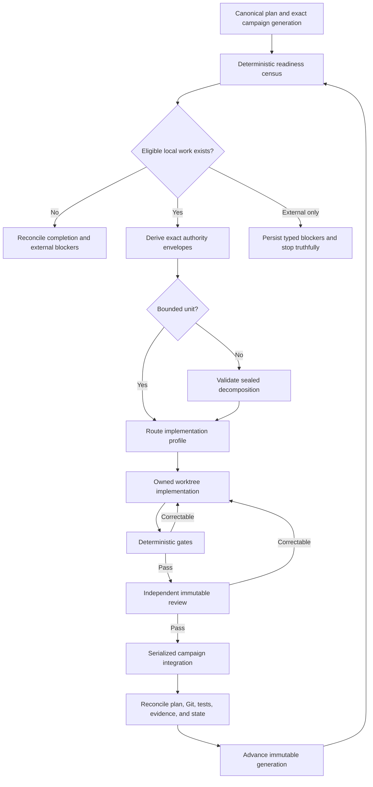

# Autonomous Roadmap Progression

## Status and Boundary

This document is normative. It defines how CodingMage may progress through locally implementable
roadmap work without routine operator decisions. [`TASKS.md`](../../TASKS.md) remains the canonical
implementation and evidence ledger; this contract does not claim that unchecked work exists.

Autonomous progression composes existing deny-first planning, isolated worktrees, bounded provider
execution, deterministic gates, immutable senior review, durable integration, and recovery. It does
not grant default-branch, release, signing, credential, purchase, or infrastructure authority.

## Progression Loop

## Deterministic Readiness Census

Before a lead or implementer runs, CodingMage classifies every open canonical sub-task as one of
`ready_local`, `waiting_dependency`, `blocked_external`, `deferred_resource`,
`needs_decomposition`, `human_decision_required`, or `unsupported`.

The census is content-minimized and binds the plan digest, campaign head, policy digest, platform
identity, provider-capability observations, task identifiers, reason codes, and reconsideration
triggers. Repository prose and provider output cannot change a classification directly.

## Authority Envelope and Decomposition

Each runnable unit binds one parent task, source anchor, base commit, owned paths, dependencies,
acceptance criteria, required artifacts, literal gates, prohibited effects, risk class, completion
predicate, and resource ceilings. Routine choices may select an implementation already implied by
those fields, but may not add dependencies, broaden paths, change public contracts, weaken tests,
alter architecture, or introduce external effects unless the canonical task explicitly authorizes
the choice.

A decomposition is valid only when child identifiers are unique and ordered, every child remains a
path and requirement subset of the parent, dependencies are acyclic, all parent acceptance criteria
are covered, no child can claim parent completion alone, and the final child requires cumulative
verification of the complete parent outcome. Decomposition state is sealed and restart-persistent.

## Replanning and Blocker Continuation

Every accepted outcome creates a new planning generation. Blocked work remains unchecked and is
excluded only by exact task identity. Independent work continues. A blocker is reconsidered only
after its declared observation changes. Repeated identical blockers, deferrals with already
satisfied triggers, or plans that produce no progress enter a typed no-progress state rather than a
busy loop.

Recoverable implementation or review failure may generate one bounded replanning decision: retry
the exact checkpoint, split an already authorized packet, route to a stronger available profile, or
defer the exact task. It cannot synthesize scope or erase failed evidence.

## Provider Routing and Watchdog

Routing combines deterministic task risk, changed ownership boundaries, required review strength,
provider capability, current availability, and failure history. Unavailability may select another
configured profile only when it meets or exceeds the required role and strength. Implementation
and review must remain independent roles.

The watchdog observes coordinator-owned process receipts, monotonic heartbeats, exact leases,
worktree manifests, checkpoints, and effect intents. Stale ownership is reobserved before cleanup.
Unknown or contradictory state fails closed; unrelated processes, branches, worktrees, and user
changes are never adopted.

## Integration and Completion

Automatic integration may advance only the configured isolated campaign branch through exact
compare-and-swap ancestry and preservation checks. Local bare-remote tests may verify push and
non-fast-forward behavior without granting authenticated publication authority.

Completion requires all locally authorized tasks to be integrated or retain a truthful terminal
noncompletion, no runnable or recoverable work to remain, cumulative gates and final review to pass,
the canonical plan projection to match Git history, and branches, worktrees, processes, locks,
journals, evidence, and status to reconcile. External work remains visibly open.

## Qualification Boundary

The final candidate must pass disposable deterministic fixtures, a frozen no-hardlinks target
clone, one supervised unit, a three-outcome unattended pilot, and a bounded approximately ten-task
soak. Each result binds exact source and target commits, configuration digest, package digest,
tasks, provider roles, gates, outcomes, residue, and limitations. No result from a concurrently
changing checkout is admissible.

