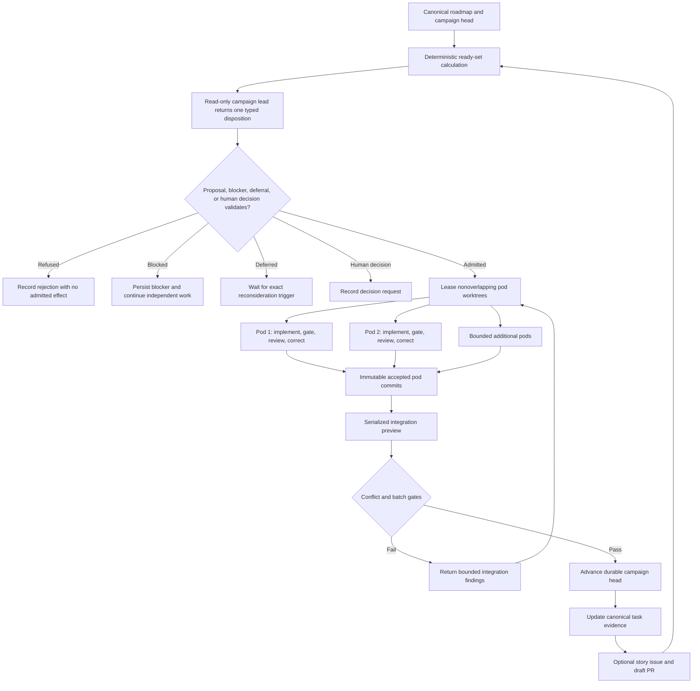

# Hierarchical Campaign Architecture

## Purpose

A CodingMage campaign coordinates a large dependency-aware roadmap as a bounded engineering team.
It combines model specialization with deterministic authority: models propose and evaluate work,
while the coordinator alone owns state, Git mutation, verification, and configured publication.

## Roles

| Role | Authority | Prohibited authority |
| --- | --- | --- |
| Product owner | Campaign scope, allowed roots, final promotion policy | None within explicit local ownership |
| Campaign coordinator | Task selection, leases, state, limits, recovery, stopping | Inventing scope or bypassing evidence |
| Campaign lead | Read-only planning, decomposition, risk and dependency analysis | Writes, Git mutation, publication, approval |
| Pod implementer | File edits inside one leased worktree and path set | Git, credentials, network, task state, publication |
| Pod reviewer | Read-only review of an immutable cumulative diff | Writes, self-approval, task state, publication |
| Deterministic verifier | Literal configured gates and evidence | Model judgment or policy changes |
| Integration lead | Coordinator-mediated ancestry, conflict, and batch verification | Direct provider Git commands or protected-branch writes |
| GitHub adapter | Configured feature push, story issue, and draft PR effects | Merge, release, settings, secrets, branch deletion |

## Control Flow

## Pod Admission

A pod starts only when all of the following are true:

- Its exact sub-task is open and dependency-ready in the current campaign-head task source.
- Its proposed paths are inside campaign-approved roots and outside denied paths.
- Its path lease does not overlap another active pod.
- Its declared test resources do not conflict with concurrently running gates.
- Its base commit and task-source digest match the current campaign snapshot.
- Required provider profiles, local capacity, and configured limits remain available.
- No unresolved architecture decision requires product-owner authority.

The campaign lead itself is a process-backed Codex profile in a read-only sandbox. Its strict
response is untrusted data, not an allocation decision. Before a pod lease exists, the coordinator
rechecks the exact campaign head, task-source digest, dependency-ready set, paths, dependencies,
gate tiers, shared resources, expected artifacts, and risk. The lead can instead return one bounded
blocked, deferred, or human-decision disposition, but it cannot combine dispositions or attach
executable instructions. These expanded dispositions are approved target behavior and remain
unchecked implementation work in Story 21.2.

## Correction Loop

Gate output used for correction is ephemeral, bounded, and delivered only to the currently
authorized implementation pod. Durable records retain hashes, outcomes, sizes, and identities, not
the diagnostic text. A correction cannot change the task, path lease, provider authority, or
completion policy. The total gate-and-review correction count is bounded per task.

After every correction:

1. CodingMage inventories changed paths.
2. CodingMage creates a child commit with fixed Git behavior.
3. Deterministic gates rerun.
4. The reviewer receives the original task base and latest candidate, covering the cumulative diff.
5. Only a passing review may reach final verification.

## Integration

Pods do not merge themselves. The integration lead operates through a deterministic coordinator
adapter that serializes repository mutations. It verifies expected campaign head, pod ancestry,
path leases, changed preimages, review identity, and gate evidence before constructing an
integration preview.

Disjoint paths are necessary but not sufficient for automatic composition. Shared schemas, public
interfaces, generated artifacts, dependency files, and common test resources can create semantic
conflicts and therefore require batch gates or sequential scheduling.

## GitHub Workflow

GitHub is a visibility and collaboration surface, not execution authority.

- Local pod commits remain private until their story or batch is verified.
- The coordinator may push one configured campaign or story branch.
- The GitHub adapter may create or update one draft PR per story or integration batch.
- Codex findings may appear as labeled automated review comments, never as human approval.
- Automatic merge into the campaign branch is a local coordinator operation backed by exact
  evidence, not a model-issued GitHub command.
- Promotion from the campaign branch to the protected/default branch remains a separate policy.

## Rollout Gates

1. One pod: gate correction, review correction, checkpoint, and exact interrupted-session resume.
2. Typed lead outcomes: blocker, deferral, reconsideration, human decision, and invalid-output refusal.
3. Serial campaign: prescribed disposable ten-outcome schedule with local-only publication.
4. Controlled target: one-pod ten-task campaign with complete human reconciliation.
5. Two pods: disjoint path leases and serialized integration.
6. Three or four pods: resource scheduling, provider pressure, and completion-order permutations.
7. Story-level draft PR publication against an authorized disposable repository.
8. Complete adversarial, package, manual fuzz, independent-review, and release-candidate gates.
9. Human-authorized merge, signed tag, release publication, and independent artifact verification.

See [`Unattended Safeguards`](unattended-safeguards.md) for the exact disposition, soak, test, and
publication contract.
