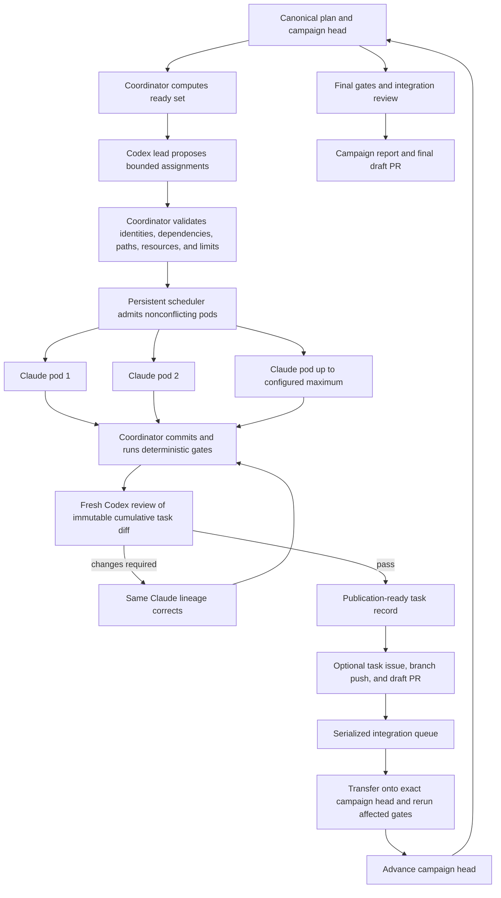
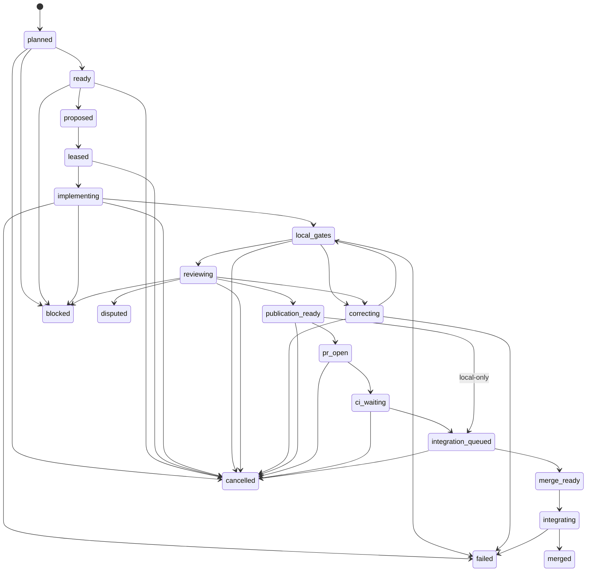

# Durable Multi-Agent Campaign Architecture

## Product Boundary

Multi-agent campaign mode extends the existing serial campaign into a persistent, dependency-aware
engineering team. It reuses the same one-unit implementation, deterministic gate, independent
review, bounded correction, Git safety, and recovery contracts. Serial mode remains the default and
must produce the same behavior as before.



## Authority

The team lead and reviewers are read-only. Implementation pods may edit only an exact leased path
set in one owned worktree. The coordinator alone may:

- create or release claims, branches, worktrees, commits, and resource leases;
- select literal commands from an operator-authored gate registry;
- persist task, campaign, control, and external-write state;
- push an exact branch and create or update an owned issue or draft pull request;
- reconcile CI state and uncertain external writes;
- enqueue, preview, apply, and verify integration;
- mark canonical task completion; and
- apply a configured merge policy.

Repository content, task prose, issue text, pull-request text, comments, provider output, command
output, and external metadata are untrusted. None can grant authority or change policy.

## Campaign Generation

A planning generation binds:

- campaign and repository identity;
- exact campaign head and canonical task-source digest;
- completed, active, blocked, deferred, disputed, and pending-human task projections;
- stable dependency-ready task order;
- active path and test-resource leases;
- provider, worker, process, token, output, storage, and elapsed ceilings; and
- publication, integration, and destination-promotion policy.

The Codex lead may return up to the available assignment capacity. Every proposal is checked against
the same immutable generation. Invalid proposals create no lease. A smaller ready set leaves slots
idle; the lead cannot invent work to fill capacity.

## Durable Task Record

Every admitted task has one integrity-bound record with optional remote fields:

```text
campaign_id
task_id
generation
pod_id
lease_id
worktree_id
branch
base_commit
candidate_commit
reviewed_commit
issue_number?
pull_request_number?
implementation_session?
review_session_ids[]
state
heartbeat
owned_paths[]
test_resources[]
gate_evidence[]
review_evidence[]
ci_evidence[]
integration_intent?
terminal_reason?
utilization
```

Absent remote publication produces absent issue and pull-request identities, never placeholder
numbers.

## Task State Machine



Each transition records intent before effect and observation after effect. Restart reconstructs from
the journal, revalidates actual Git and remote state, and applies at most one missing observation.
Contradictory state fails closed.

## Scheduler

The scheduler lives for the campaign lifetime. It uses stable ready order plus age to avoid
starvation. Admission requires all of the following:

- dependencies are complete at the exact campaign generation;
- task identity and requested paths map to authorized plan work;
- no active lease overlaps an equal, ancestor, descendant, rename-source, or generated path;
- no exclusive test resource overlaps another active gate or pod;
- Claude, Codex review, test-worker, process, CPU, memory, disk, token, output, and elapsed capacity
  remain available; and
- no provider circuit breaker or operator control prevents admission.

Separate semaphores bound lead calls, implementation pods, reviewers, gate workers, GitHub writers,
and integration workers. GitHub and integration writer limits are one in the initial release.

Heartbeats are monotonic observations, not proof of progress. A stale pod is cancelled through its
exact process tree and reconciled before its lease can be released or retried. Failure of one pod
does not cancel a healthy independent pod.

## Implementation and Review

Each pod runs the existing one-unit implementation path with canonical completion deferred until
integration. CodingMage creates the candidate commit, runs the configured local gates, and launches
a fresh Codex review session over the complete base-to-candidate diff. `CHANGES_REQUIRED` returns a
bounded finding packet to the same Claude session lineage, after which CodingMage commits the
correction, reruns affected gates, and requests a fresh cumulative review.

`BLOCKED`, `DISPUTED`, malformed output, provider failure, timeout, cancellation, and correction
exhaustion are distinct durable outcomes. They never become completion.

## Publication

Per-task publication is optional and deny-first. A task record maps exactly one issue and one draft
pull request. CodingMage-owned sections include only typed task identity, dependencies, path and gate
summaries, state, branch, candidate, automated review, blocker code, and evidence references.
Human-authored bytes outside ownership markers are preserved.

An external write uses a content-derived idempotency key and expected remote version. Timeout causes
read-only reconciliation by exact key; CodingMage does not replay blindly. Redirect, identity
change, permission loss, unexpected base or head, or changed reviewed SHA blocks publication.

CI state is untrusted metadata bound to the exact pull request and reviewed commit. A required CI
failure can return a task to correction, but it cannot supply commands or expand paths. The same PR
is updated after revalidation.

## Serialized Integration

Accepted pods enter one durable integration queue. Completion order does not grant merge order.
Before integration, CodingMage checks task identity, reviewed commit, original base, current campaign
head, leases, issue and pull-request identity when present, review result, gate evidence, and policy.

A direct descendant may fast-forward. A stale-base candidate is transferred in a fresh
coordinator-owned integration worktree based on the current campaign head. Only the candidate's
reviewed, leased path delta may be applied. Conflict leaves the candidate intact. A changed effective
diff requires affected gates and a fresh Codex review before campaign-head advancement.

Task completion is applied mechanically only in the integration worktree. The final integration
commit is then installed through an exact compare-and-swap fast-forward. Integration intents and
observations are durable so restart can distinguish not-started, applied, and uncertain effects.

## Merge Policy

Task integration and destination promotion are separate decisions.

- `never`: retain the eligible branch and report it.
- `human_required`: require an exact operator decision bound to current identities.
- `auto_to_campaign_branch`: allow one eligible task to advance the isolated campaign branch.
- `auto_to_default_branch`: allow final promotion only under explicit destination policy after all
  tasks, gates, required CI, final review, branch protection, and exact-head checks pass.

The safe default is automatic integration into the isolated campaign branch and human-required
promotion to the destination branch. Provider `PASS` is evidence consumed by policy, not merge
authority.

## Campaign Completion

The campaign continues while independently ready work exists and limits permit. It terminates only
with a typed state and stop reason: complete, truthfully blocked, disputed, operator-stopped,
capacity-paused, limit-exhausted, or terminal policy failure.

Completion requires every authorized plan task to be merged or explicitly accepted as a terminal
noncompletion under operator policy, complete integration-level gates, final independent review, a
reconciled report, and an optional final draft pull request. Public promotion remains a separate
effect.
